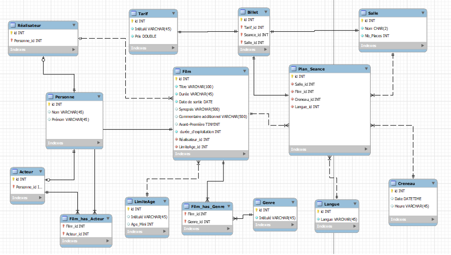

# Evaluation 2 - Cinema

## Description
Ce projet a été réalisé dans le but d'être évalué sur les connaissances acquises durant les cours que j'ai pu suivre en SQL. Il s'agit d'un sujet porté sur le système d'information d'un cinéma régional. Il m'est demandé de concevoir et d'implémenter la base de données. La base doit servir à l'organisation du plan de séances, à la billetterie et au contenu éditorial du site internet du cinéma.

## Table des matières
1. Initialisation de la base de données, insertion des données nécessaires et execution des requêtes
2. Modele conceptuel de données

## Initialisation
### 1. Cloner le projet
Pour débuter, il est nécessaire de cloner ce repositorie github afin d'obtenir les fichiers nécessaires. Utiliser la commande ci-dessous :

git clone git@github.com:JulD05/cinemaSql.git

### Création de la base, insertion des données et insertion des requêtes
Une fois le clone du repositorie réalisé, utiliser les 3 commandes suivantes dans un terminal se trouvant dans le dossier du dépôt cloné précédemment.
#### Création de la base de données
mysql -u username -p < schema.sql
#### Insertion des données
mysql -u username -p cinema < data.sql
#### Insertion des requêtes
mysql -u username -p cinema < queries.sql

## Modele conceptuel de données

